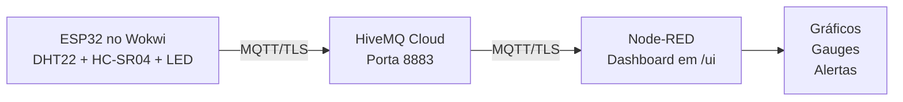

# Fidelis VET - Coleira IoT para Monitoramento Pet

Protótipo simulado de uma coleira inteligente baseada em IoT para monitoramento contínuo da saúde de pets em tempo real.

## Sobre o Projeto

O **Fidelis VET** foi pensado para ajudar tutores e veterinários a detectar febre e mudanças de atividade logo no início. A solução lê temperatura corporal, umidade e nível de atividade aproximado do animal, envia os dados para a nuvem e exibe tudo em um dashboard interativo. Quando há anomalias, como febre, o sistema aciona alertas automáticos e o LED da coleira.

## Tecnologias Utilizadas

| Camada | Tecnologia |
|--------|-----------|
| Hardware simulado | ESP32, DHT22, HC-SR04 e LED |
| Simulador | [Wokwi](https://wokwi.com/) |
| Comunicação | MQTT com TLS |
| Broker | HiveMQ Cloud |
| Software embarcado | C++ / Arduino Core |
| Dashboard | Node-RED + node-red-dashboard |
| Formato dos dados | JSON |

## Sensores e Funções

| Componente | Dado | Finalidade |
|------------|------|-----------|
| DHT22 | Temperatura e umidade | Detectar febre acima de 39.5°C |
| HC-SR04 | Distância em cm | Inferir o nível de atividade do pet |
| LED vermelho | Alerta visual | Acende quando há febre |

## Como os Dados são Publicados

**Tópico MQTT:** `fidelis/coleira/dados`

Exemplo de payload:

```json
{
  "dispositivo": "fidelis-coleira-001",
  "temperatura": 38.5,
  "umidade": 65.0,
  "distancia_cm": 45.0,
  "atividade": "moderado",
  "alerta_febre": false,
  "timestamp_ms": 12500
}
```

### Classificação de atividade

| Distância | Classificação |
|-----------|--------------|
| Menor que 30 cm | inativo |
| Entre 30 e 80 cm | moderado |
| Maior que 80 cm | ativo |

## Instruções de Uso

### 1. Rodando a Simulação no Wokwi

1. Acesse [wokwi.com](https://wokwi.com/) e crie um projeto ESP32.
2. Use o firmware em [`src/main.cpp`](src/main.cpp).
3. Mantenha o circuito definido em [`diagram.json`](diagram.json).
4. Rode a simulação.
5. O ESP32 vai conectar no WiFi `Wokwi-GUEST` e publicar a cada 5 segundos.

> O firmware usa HiveMQ Cloud com TLS e autenticação, então as credenciais e o broker precisam estar configurados em [`src/main.cpp`](src/main.cpp).

### 2. Configurando o Dashboard no Node-RED

1. Instale o Node-RED localmente ou use uma instância em nuvem.
2. Certifique-se de ter o pacote `node-red-dashboard` instalado.
3. Abra o Node-RED e vá em **Menu > Import**.
4. Importe o fluxo de [`flows/flows.json`](flows/flows.json).
5. Clique em **Deploy**.
6. Acesse o dashboard em `http://localhost:1880/ui`.

### 3. Verificando a Comunicação

Com a simulação rodando e o fluxo do Node-RED implantado, os dados devem aparecer automaticamente no dashboard a cada 5 segundos.

Para testar o alerta de febre, altere o valor de temperatura do DHT22 no [`diagram.json`](diagram.json) para algo acima de `39.5` e reinicie a simulação.

## Arquitetura



O firmware publica em MQTT no broker HiveMQ Cloud, e o fluxo do Node-RED consome os mesmos dados para compor o dashboard.

## Resultados Parciais

Durante o desenvolvimento da prova de conceito, estes pontos já ficaram validados:

* **Estabilidade de comunicação:** conexão MQTT com TLS, `keep-alive` ajustado e publicação contínua a cada 5 segundos.
* **Regras de negócio na borda:** leitura local dos sensores, classificação de atividade e acionamento do LED sem depender do servidor para decidir o alerta de febre.
* **Interface amigável:** dashboard focado em leitura rápida dos dados, com gráficos, medidores e alerta visual para febre.

## Equipe Driven Soft

### Integrantes

| Nome | RM |
| --- | --- |
| Felipe Bezerra Beatrici | RM 564723 |
| Max Hayashi Batista | RM 563717 |
| Henrique Cunha Torres | RM 565119 |

## Vídeo Pitch

* [LINK VIDEO NAO CRIADO AINDA]()